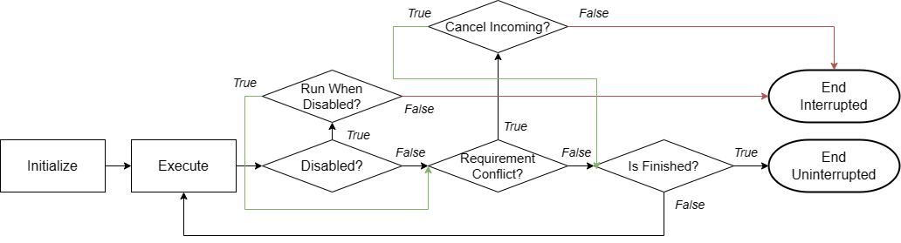

<!-- _class: cover_d -->
<!-- _paginate: "" -->
<!-- _footer:  -->
<!-- _header:  -->

# FRC Design Patterns

###### Command-Based Programming in Java and WPILibJ

FRC Season 2024 Cresendo - GT Kickoff Software (Language) Workshop
Instructional Center 105, 9:30 - 10:15

RoboJackets - Competitive Robotics at Georgia Tech
Zimeng Chai
<zimeng.chai@gatech.edu>

## About Me
<!-- _class: cols-2 -->

<div class="ldiv">

**Zimeng Chai**

- Previous Team & Software Sub-team Lead of IronPulse Robotics (Team 6941)
- Current Freshman majoring in Computer Engineering at GT
- Member of RoboJackets, RoboRamblers, and The Laboratory for Intelligent Decision and Autonomous Robots
<br>


</div>

<div class="rimg">


</div>

## Robots that I Built and Programmed
<!-- _class: cols-3 -->

<div class=ldiv>


_Acetate - 2022 Rapid React_

</div>

<div class=mdiv>


_Hydrogen - 2023 Charged Up_

</div>

<div class=rdiv>


_Kyanite - 2023 Rapid React Replay_

</div>

</div>

<div class=rimg>

</div

---

<!-- _class: toc_a -->
<!-- _header: "CONTENTS" -->
<!-- _footer: "" -->
<!-- _paginate: "" -->

- [Introduction to Design Patterns](#3)
- [From Plain Looper to Command-Base](#3)
- [Structure of Command-Based Programs](#3)
- [Creating Subsystems](#3)
- [Creating Commands](#3)
- [Writing Testable and Simulatable Code](#3)
- [Conclusion](#3)

## Introduction to Design Patterns

<!-- _class: trans -->
<!-- _footer: "" -->
<!-- _paginate: "" -->

## Introudction to Design Patterns
<!-- _class: fixedtitleA -->

- Design Patterns are **typical solutions** to common software design problems.
- "How you **Organize** and **Write** your code following a certain **Paradigm**."

- Common design patterns include:
  - Creational: Factory, Singleton, Builder ...
  - Behavioral: State, Iterator, **Commands**, Observer(Subscriber) ...
  - Structural: Bridge, Proxy, Dectorator...
- Design patterns helps us to solve common software engineering problems under a framework of known-best-practices.

For a systematic guide / handy reference, please check [Refactoring Guru](https://refactoring.guru/design-patterns) or other books about design patterns and their applications.

## From Plain Looper to Command-Based

<!-- _class: trans -->
<!-- _footer: "" -->
<!-- _paginate: "" -->

## From Plain Looper to Command-Based - Looper Review
<!-- _class: cols-3 -->

<div class="ldiv">

Looper is one of the most common way we can write our FRC Robots - directly run all the methods via a update loop (no matter its at base level or divided into sections).

</div>

<div class="mdiv">

```java
public class Robot extends TimedRobot {
  // ...
  @Override
  public void robotPeriodic() {
    // run repeated since started
  }

  @Override
  public void disabledPeriodic() {
    // run repeated during disabled
  }

  @Override
  public void teleopPeriodic() {
    // run repeated during teleop
  }

  @Override
  public void testPeriodic() {
    // run repeated during test
  }
  // ...
}
```

</div>

<div class="rdiv">

```java
private final CrashTrackingRunnable runnable_ 
    = new CrashTrackingRunnable() {
    @Override
    public void runCrashTracked() {
        synchronized (mTaskRunningLock) {
            if (mRunning) {
                double now = Timer.getFPGATimestamp();

                for (Loop loop : mLoops) {
                    loop.onLoop(now);
                }

                mDT = now - mTimestamp;
                mTimestamp = now;
            }
        }
    }
};

public Looper(double period) {
    mNotifier = new Notifier(runnable_);
    mPeriod = period;
    mRunning = false;
    mLoops = new ArrayList<>();
}
```

Author: The Cheesy Poofs, Team 254, [Code Link](https://github.com/Team254/FRC-2023-Public/blob/main/src/main/java/com/team254/lib/loops/Looper.java)


</div>

## From Looper to Command-Based - Pros and Cons
<!-- _class: cols-2-46 -->
<div class="ldiv">

###### Pros

- Simple!
  - Thought Simplicity: direct call to methods, no mediator
  - Debug Simplicity: rather easy to find problems by directly looping and logging things out
- Can Reach High Level of Subsystem Autonomy
  - Periodic updates & response
  - Self-sustained, require less thoughts on the calling side

</div>

<div class="rdiv">

###### Cons

- Timed / Stepped Action is Hard to Write
  - e.g. Monkey Bar from Rapid React
  - Use clumsy `TimedBoolean`, `Timer` and status flags
- Coordination Complexity
  - "Super Cooridinator" for automation
  - Complex Cross-Subsystem actions (e.g. Autonomous)
- Command Conflicts
  - Have to judge and handle different commands from different sources, keeping only one
  - Huge amount of flags, if / else, debug and test
- Highly Coupled - Maintainence Difficulties

</div>

## Structure of Command-Based Programs

<!-- _class: trans -->
<!-- _footer: "" -->
<!-- _paginate: "" -->

## Structure of Command-Based Programs - Commands
<!-- _class: cols-2 -->

<div class="ldiv">

Commands are at the core of Command-Based Programming practices.
Commands are **actions** a robot can take to complete a certain task, combined in a certain way.

There a 4 core components of a command:

- Initialization - `initialize()`
- Execution - `execute()`
- End - `end(bool isInterrupted)`
- Judge Condition - `isFinished()`

The 4 components make the command itself a small state-machine, giving it high flexibility.

</div>

<div class="rdiv">

```java
// commands can be created by extending CommandBase
public class ShooterCommand extends CommandBase { 
    private DoubleSupplier controlTarget;
    private Shooter shooter;
    public ShooterCommand(Shooter shooter, DoubleSupplier controlTarget) {
        this.shooter = shooter;
        this.controlTarget = controlTarget;
        // add requirement to subsystem for exclusive access
        addRequirements(this.shooter); 
    }

    @Override
    public void initialize() {
        shooter.setVolts(0.0);   
    }

    @Override
    public void execute() {
        shooter.setVolts(controlTarget.getAsDouble());
    }

    @Override
    public void end(boolean interrupted) {
        shooter.setVolts(0.0);
    }

    @Override
    public boolean isFinished() {
        return false;
    }
}
```

</div>

## Structure of Command-Based Programs - Commands (Cont)
<!-- _class: fixedtitleA -->

Commands will be run repeated until `isFinished()` return true.
Command will always be run once after a successful scedule. (i.e. `initialize()`, `execute()`, `end()` will be invoked at least once, even `isFinished()` returned true initially.)

<br>



## Structure of Command-Based Programs - Command Sceduler
<!-- _class: cols-2-46 -->

<div class="ldiv">

Strictly speaking, Command-Based Programming is still "Looper". But it has more encapsulation, providing more convenience features, while solving the 3 problems mentioned before.
Singleton `CommandSceduler`'s `run` method is called on every iteration of `TimedRobot`.

```java
public class Robot extends TimedRobot {
  // ...
  @Override
  public void robotPeriodic() {
    CommandScheduler.getInstance().run();
  }
  // ...
}

```

</div>

<div class="rimg">


</div>

## Creating Subsystems

<!-- _class: trans -->
<!-- _footer: "" -->
<!-- _paginate: "" -->

## Creating Subsystems - Basics
<!-- _class: fixedtitleA -->
Subsystem extends `SubsystemBase` class. You can also create subsystems by implementing the `Subsystem` interface, but you have to register the subsystem yourself afterwards.

```java
import edu.wpi.first.wpilibj2.command.SubsystemBase;

public class Shooter extends SubsystemBase {
    @Override
    public void periodic() {
        // periodic updates
    }
    @Override
    public void simulationPeriodic() {
        // periodic updates under simulation
    }
}
```

## Creating Subsystems - Unique Access using Singleton
<!-- _class: cols-2-46 -->

<div class="ldiv">

Subsystem Characteristics:

- Uniqueness - Acquire Hardware Resources
- Universal Access

Here, we can use **Singleton** - a design pattern to ensure **unique**, **global** access to subsystems.

<div class="center">


</div>

</div>

<div class="rdiv">

```java
// singleton example
public class Shooter {
    private static Shooter instance; // static instance, allow access without instance
    private Shooter() {
        // private, prevent being called other than this class
    }

    public static Shooter getInstance() {
        // static method, access without a instance
        if(instance == null) {
            instance = new Shooter(); // create when no existing instance exists
        }
        return instance;
    }

    public void setRPM(double rpm) {}

    public void setVolts(double voltage) {}
}

// example usecase
private void test() {
    // all the getInstance() methods generate the same Shooter instance
    Shooter s = Shooter.getInstance();
    Shooter.getInstance().setRPM(100.0);
    s.setVolts(0.0);
}

```

</div>

## Creating Subsystems - Seperating Responsibilities
<!-- _class: fixedtitleA -->

The most important question to ask: **What should this Subsystem DO?**

- Problem of Scope and Control
  - What should be done by the commands? What should be done by the Subsystem?
  - How "high-level" should this Subsystem go?

<!-- _class:  bq-blue -->
> General Rules of Thumb
>
> 1: Subsystems should control the hardwares to directly reach a desired **state** you set as the target.
> 2: Anything that requires **coordination** should be handled by the Commands.
> 3: Anything that relates to **info publishing & state updating** should be handled by the Subsystems.
> 4: **Common parts** among a lot of commands should be taken out and encapsulated in the Subsystems.
> 5: If you are not sure, then generally leave things to new Commands (it's command-base programming!).

## Creating Subsystems - Seperating Responsibilities (Cont)
<!-- _class: cols-2 -->

<div class="ldiv">

```java
public class Swerve extends SubsystemBase {
    private SwerveModuleState[] moduleStates;

    public void drive(ChassisSpeeds chassisSpeeds) {
        setModules(kinematics.toSwerveModuleStates(chassisSpeeds));
    }

    public void stop() {
        drive(new ChassisSpeeds());
    }

    public void setModules(SwerveModuleState... states) {
        if(states.length != moduleStates.length) return;
        System.arraycopy(states, 0, moduleStates, 0, states.length);
    }

    public Rotation2d getGyroAngle() {
        return gyroAngle;
    }

    @Override
    public void periodic() {
        for(int i = 0; i < moduleStates.length; ++i) {
            // control the motors to reach target states...
        }
    }
}
```

</div>

<div class="rdiv">

```java
public class Swerve extends SubsystemBase {
    private SwerveDriveKinematics kinematics 
            = Constants.SwerveConstants.KINEMATICS;
    private ChassisSpeeds speed = new ChassisSpeeds();
    private Rotation2d gyroAngle = new Rotation2d();
    private boolean orientMode = false;   

    public void drive(ChassisSpeeds cs, boolean isFieldOriented) {
        speed = isFieldOriented 
            ? ChassisSpeeds.fromFieldRelativeSpeeds(cs, gyroAngle)
            : cs;
    }

    public void stop() {
        drive(new ChassisSpeeds(), false);
    }

    public void orientModules(SwerveModuleStates... states) {
        // orient the modules
    }

    @Override
    public void periodic() {
        if(orientMode) {
            // control the motors for orientation...
        } else {
            for(SwerveModuleState s : kinematics.toSwerveModuleStates(speed)) {
                // control the motors to reach target states...
            }
        }
    }
```

</div>

## Creating Subsystems - Seperating Responsibilities (Cont)
<!-- _class: fixedtitleA -->

Other Common Dilemmas:

- Using a PIDCommand or a PIDController in the Subsystem?
- Using a SwerveControllerCommand or a TrajectoryFollower in the Subsystem?
- Using a Command to control joints of an arm, or only control the end-effector position while leaving the rest of the calculation to the Subsystem?
- ...

<!-- _class: bq-red -->
> Set Your Standard!
>
> Commands are powerful, as they are small state-machines that can even be combined. However, some of the common basic parts should be given to the subsystem to reduce verbosity of writing commands.
> **Set your standard, and follow it!**

## Creating Commands

<!-- _class: trans -->
<!-- _footer: "" -->
<!-- _paginate: "" -->

## Creating Commands - Command Grouping & Chaining
<!-- _class: cols-2-46 -->

<div class="ldiv">

Commands can be grouped together using **Command Groups**.
Common Command groups includes:

- Sequential
- Parallel
  - Normal
  - Race
  - Deadline

Combining command groups can create complex commands.
</div>

<div class="rimg">


</div>

## Creating Commands - Using Command Factory & Decorators
<!-- _class: cols-2-46 -->

<div class="ldiv">

There are command we repeatedly use:

- Run a single method
- Run in parallel / sequence / race / deadline
- Print debugging messages
- ...

We can use the **Factory** provided by WPILib  - **Commands** class, to conveniently create them in a semantic and highly readable way.

To view all the things, check [WPILib API Doc](https://first.wpi.edu/wpilib/allwpilib/docs/release/java/edu/wpi/first/wpilibj2/command/Commands.html).

</div>

<div class="rdiv">

```java
// trick to directly import all the static methods for Commands class, so saving a bunch of "Commands.xxx"
import static edu.wpi.first.wpilibj2.command.Commands.*;

// not use factory (at all)
public Command getAutonomousCommand() {
    return new ParallelCommandGroup(
        new SequentialCommandGroup(
            new PrintCommand("Prepare my best over-the-bump 3 game piece auton!!!!!"),
            new WaitCommand(1.0),
            new PrintCommand("whoops")),
        new SequentialCommandGroup(
            new ParallelRaceGroup(
                new RunCommand(() -> Shooter.getInstance().setRPM(100.0),
                    Shooter.getInstance()),
                new WaitCommand(0.5)),
            new InstantCommand(Shooter.getInstance()::stop, Shooter.getInstance())
        )
    );
}

// use factory
public Command getAutonomousCommand() {
    return parallel(
        sequence(
            print("Prepare my best over-the-bump 3 game piece auton!!!!!"),
            waitSeconds(1.0),
            print("whoops")),
        sequence(
            run(() -> Shooter.getInstance().setRPM(100.0), Shooter.getInstance()).withTimeout(0.5),
            runOnce(Shooter.getInstance()::stop, Shooter.getInstance())));
  }

```

## Creating Commands - Use Command Factory Methods
<!-- _class: cols-2 -->

<div class="ldiv">

###### Flow

- `RunCommand`, `StartEndCommand`, `RunEndCommand`
  - `run` - repeat one
  - `runOnce` - run one time
  - `startEnd` - run once, then another
  - `runEnd` - repeat one, then start another
- `SequentialCommandGroup`, `ParallelCommandGroup`
  - `sequence` - run in series
  - `parallel` - run group, finish when all finished
  - `race` - run group, finish when any is finished
  - `deadline` - run group, finish when ddl reached

</div>

<div class="rdiv">

###### Selection

- `ConditionalCommand`, `SelectCommand`
  - `either` - choose one from two
  - `select` - choose one from multiples

###### Time Related

- `WaitCommand`, `WaitUntilCommand`
  - `waitSeconds` - wait n seconds
  - `waitUntil` - wait for a condition

###### Utility

- `InstantCommand`, `PrintCommand`
  - `none` - do nothing, `print` - print message

</div>

## Creating Commands - Factory of Factories
<!-- _class: fixedTitleA -->

You can combine commands to create your own factory, then again combine those more high-level commands, finally creating very complex actions.

```java
 /** Scores one game piece and balances from the center */
private Command centerScoreOneAndBalance(NodeLevel level, int position) {
    var objective = new Objective(position, level, ConeOrientation.UPRIGHT, false);
    var scoringSegment = driveAndScore(objective, false, true, false, startingLocations[position], false);
    return sequence(
        reset(startingLocations[position]),
        scoringSegment.command(),
        armToHome(),
        Commands.waitUntil(arm::isTrajectoryFinished),
        driveAndBalance(scoringSegment.pose()));
}
```

Author: Mechanical Advantage, Team 6328   [Code Link](https://github.com/Mechanical-Advantage/RobotCode2023/blob/main/src/main/java/org/littletonrobotics/frc2023/commands/AutoCommands.java#L377)

## Creating Commands - Use Triggers
<!-- _class: cols-2 -->

<div class="ldiv">

Finally, after creating all the Commands, they should be binded to a certain `Trigger` that starts them.

Triggers will be polled every iteration of the `EventLoop`. When condition is met, the trigger will scedule the command in a certain way (depending on the type of the `Trigger`).

Triggers can be directly created via `Trigger` class, or can be created by the factories inside `CommandGenericHID` for convenient binding.

</div>

<div class="rdiv">

```java
// Bind via CommandGenericHID Factories
private void configureBindings() {
    controller.button(1)
    .onTrue(
        run(
            () -> Shooter.getInstance().setRPM(100.0),
            Shooter.getInstance()))
    .onFalse(
        runOnce(
            () -> Shooter.getInstance().stop(),
            Shooter.getInstance()
        )
    );
}
```

</div>

## Writing Simulatable Code

<!-- _class: trans -->
<!-- _footer: "" -->
<!-- _paginate: "" -->

## Use "Simulate Robot"
<!-- _class: cols-2-46 -->

<div class="ldiv">

You can enable the "Desktop Support" feature when creating project, so you can use simulate your code.

During simulation, beside `periodic()` for each Subsystem, `simulationPeriodic()` will also be run. You can write code in that section for simulation updating logic.

```java
public void run() { // inside CommandSceduler run()
    // ...
    for (Subsystem subsystem : m_subsystems.keySet()) {
        subsystem.periodic();
        if (RobotBase.isSimulation()) {
            subsystem.simulationPeriodic(); // additional
        }
    }
    // ...
}
```

</div>

<div class="rimg">


</div>

## Some Final Tips
<!-- _class: fixedtitleA -->

- **KNOW YOUR LIMIT** – Time, Budget, and Human Resources.
- **KNOW YOUR HARDWARE**. If possible, IMPROVE YOUR HARDWARE. There are something that is just too hard to control, or the time spent is not worth of the return.
- **MAKE THINGS SIMPLE** (unless you have the resources and time to make it work). Do not overcomplicate things in the season. Utilize existing solutions.
- Write code that can be tested, debugged, and (potentially) simulated, so you can find problems faster. Finding problems means that you have the chance to fix, refactor and improve.
- Violent tests! There are things that will only break under field conditions.
- Keep calm, keep passionate and enjoy!


## Thank You For Listening! Happy Kickoff to Cresendo!
<!-- _class: cols-2 -->
<!-- _paginate: false -->
<!-- _header: "" -->
<!-- _footer: "" -->

<div class="ldiv">

**Access to the Slide:**


</div>

<div class="rdiv">

**My Contact:**
Zimeng Chai, *zimeng.chai@gatech.edu*

The rest of the time is left for Q&As. Don't forget to check your belongings before you leave!

Opening Ceremony for Kickoff will be held at **Ferst Center for the Arts** at **11:00**. Doors will open at **10:30**. Take your time to be there!


</div>
